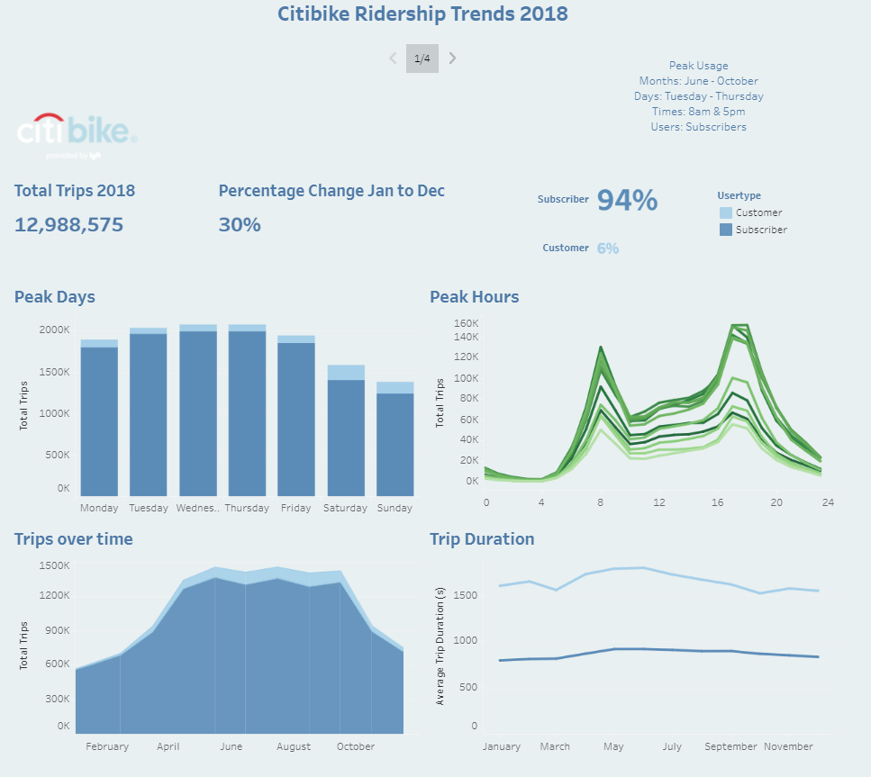
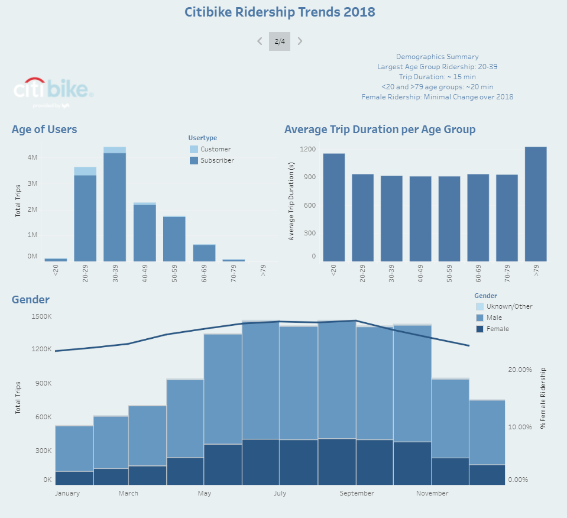
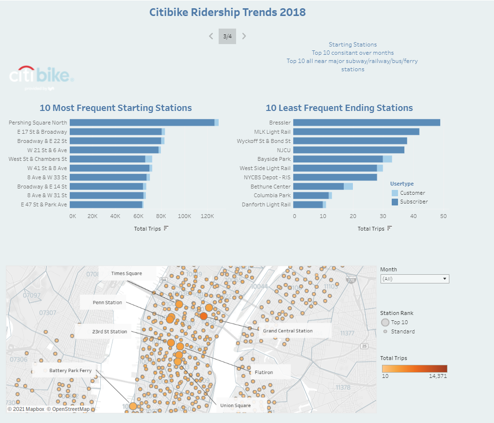

# Citi Bike Analysis

## Introduction

Citi Bike 2018 trip histories from NYC and Jersey were downloaded from https://www.citibikenyc.com/system-data.
The csv files loaded into a jupyter notebook using pandas. Pandas was also used to combine and clean the data. The
final cleaned data was exported as a csv and uploaded into Tableau. Graphs, dashboards and a story analysing ridership 
trends over 2018 are published here: https://public.tableau.com/app/profile/fern1230/viz/CitibikeHWFB/CitibikeRidershipTrends2018?publish=yes.

## Structure
```

|__2018/                 
|__clean data/   
|    |__ about.html              
|__ .gitignore
|__ citibike.ipynb    

```

## Usage

```
- python 3.8.5
- pandas 1.2.4
- Tableau Public 2021.2

```

## Summary of Ridership Trends

### Observation 1: Peak Usage



Of the two user groups, subscribers made up the majority of ridership. 94% of trips were by subscribers which are
most likely commuters who would use the service regularily.

The peak travel time periods by month were May and October, which are the warmer months with better weather. 
There was also an increase in customers in this time period which may indicate an increase use by tourists or 
people on holiday.

The peak travel time periods by day are Tuesday to Thursday with a significant descrease on the weekend. This 
suggests that the majority of users are commuters. There is a slight increase in customer usage on the weekend
which is in line with the increased usage during the May - October peak tourist periods.

The peak travel time periods by hour of day are 8 am and 4-5pm which are the peak commuter travel times. This
further supports the theory that most users are commuters.

The average trip duration for subscribers remains stable over the months and is approximately 15 minutes, which
supports the theory of commuters travelling the same routes over the time period. The customer trip durations are longer 
(~ 20 min) and have slightly more variation as the customers would generally not be the same people repeating the same 
routes daily.

### Observation 2: Demographics



The age and gender demographics rely on user input and may be an unreliable source of data. The original dataset had
a vast number of riders born in 1969. As this was thought to be faked the data points were removed. Data points where the
birth year was less than 1930 were also removed.

It can be seen that the majority of users are between 20 and 39 years old. The average trip duration across all age groups 
is comparable, ~15 min. It is slightly higher in groups >79 and <20, ~20 min. This difference is fairly minimal, the cause
may be the smaller datasets.

The majority of users are male, there is a minimal change in female ridership over the examined time period. It would be
difficult to tell if there has been any change in ridership due to increased advertising to target demographic.

### Observation 3: Starting Stations



The Top 10 starting and ending stations are all located near busy subway, train, bus and ferry stations. This again supports the 
hypothesis that the majority of ridership are commuters. The most popular station is near Grand Central Station which would 
see a high number of travellers and commuters. 

There is limited variation in the starting stations popularity over the months however there was a drop in ending popularity 
the two ferry stations towards the end of the year.


